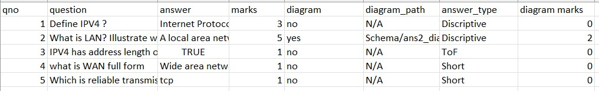

# Automated Answer Paper Evalutor

The Automated Answer Paper Evaluator leveragesmachine learning techniques to provide an efficient and accurate assessment of student answer sheets. This system integrates various technologies, including Microsoft Azure OCR, NLTK, and YOLO v8, to deliver a comprehensive solution for educational institutions.

## Parameters to evalute
- Lenght of answer
- Spell check & grammer
- Validating with expected answer
- Validating student answers using web resources.
- Diagram similarity with expected diagram
- Validating diagram labels

## Supported answer types
- True Or False
- Short/One-word answers
- Descriptive answers
- Diagrams

## Procedure 
- Input expected answers schema
- Input Students answer paper
- Extract answer from student paper using OCR
- Segemetation of answers extacted and map them into csv file
- Extract diagrams
- Evalution
- Creation of CSV file having Obtained marks

## How to give Students Answer paper as inputs
- Make a folder for each student containing images of Student's Answer paper in the order
- Save images by the name "ans_paper{X}.jpg" where x is page number
- eg: for first page save it as ans_paper1.jpg
- Give the path of that folder in the modal

## How to give Expected Answers Schema as inputs
- In the folder "Schema" create a csv file by name "Schema.csv"
- The csv must contain the following data

- Fill Answer type column , for Descriptive answers - "Discriptive", for Short-one word answers - "Short", for True or false - "ToF".

## Authors

 
- [@Chandan J](https://github.com/chan177)
- [@Ashwin D](https://github.com/Ashwin-codess)
- [@Adithya B](https://github.com/adithya603)
